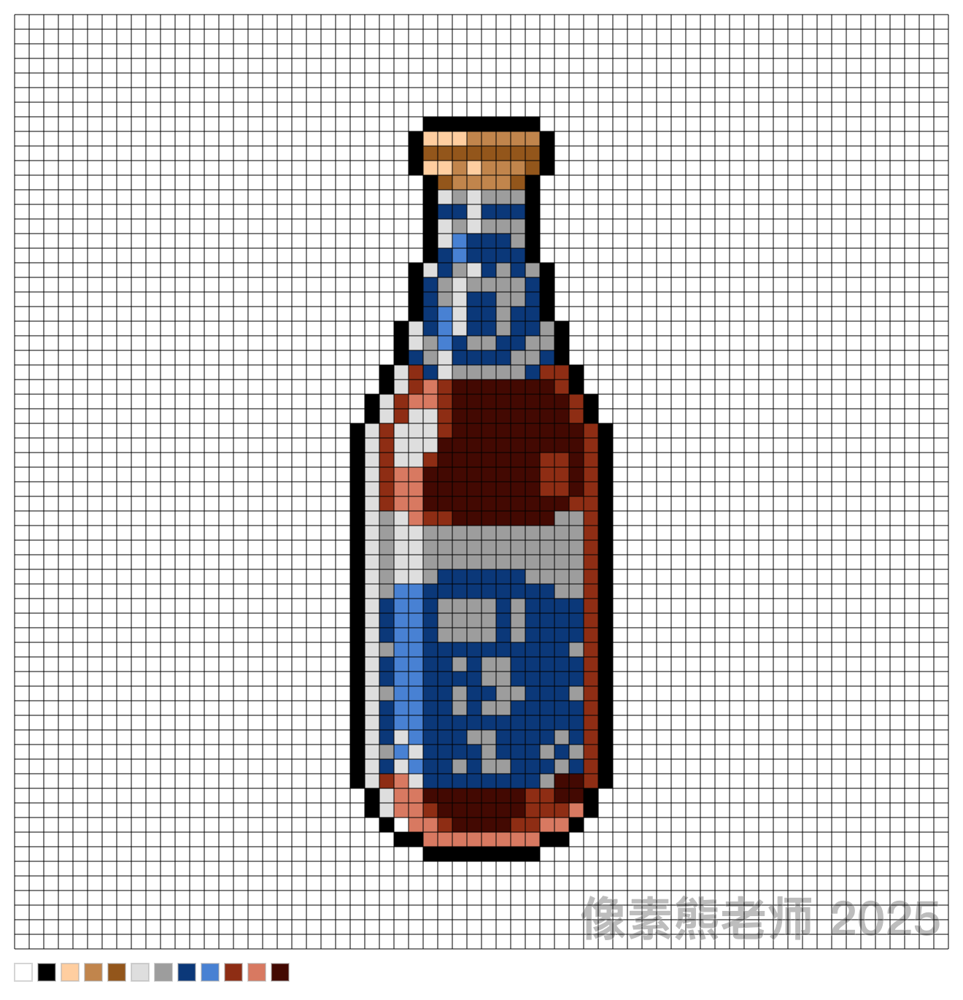

# 像素画网格与调色板生成器

[English](./README.en.md) | [繁體中文](./README.zh-TW.md)

一个为像素画爱好者设计的在线工具，可以快速为您的像素画作品（如16x16, 32x32等）生成带网格和调色板的放大预览图，并支持添加自定义水印。

这个项目是基于一个纯前端的实现，所有的图像处理都在用户的浏览器中完成，确保了速度和用户数据的隐私性。

## ✨ 主要功能

- **上传PNG图片**: 支持上传小尺寸的像素画PNG文件。
- **图像放大**: 可自定义放大倍数（2-32倍），并保持像素块的边缘清晰。
- **网格生成**: 在放大后的图像上自动绘制与像素对齐的网格。
- **调色板提取**: 自动分析并展示作品中使用的所有颜色。
- **自定义水印**: 允许用户输入文本作为水印，并调节其透明度。
- **多语言支持**: 自动适配简体中文、繁体中文和英文界面。
- **设置记忆**: 自动在本地保存用户对放大倍数、水印文本和透明度的设置。
- **纯客户端处理**: 所有操作均在浏览器中完成，无需上传到服务器，响应迅速且保护用户隐私。
- **一键下载**: 将生成的带网格、调色板和水印的最终图片下载到本地。

## 🚀 技术实现

该工具完全基于HTML、CSS和原生JavaScript实现，不依赖任何外部框架。

### 设计原则
1.  **简洁直观**: UI设计遵循极简原则，用户进入页面即可理解核心操作流程：“上传 -> 设置 -> 下载”。
2.  **纯客户端处理**: 图像处理完全在用户浏览器中通过JavaScript执行，带来了三大优势：
    - **速度快**: 无需网络上传，处理即时完成。
    - **隐私性好**: 用户的作品数据不会离开本地计算机。
    - **成本低**: 无需服务器存储和计算资源。
3.  **即时反馈**: 用户的任何操作（如调整放大倍数、输入水印）都会立刻在预览区域更新，所见即所得。

### 核心逻辑
1.  **文件读取**: 使用 `FileReader` API 异步读取用户上传的PNG文件。
2.  **颜色提取**:
    - 将上传的图像绘制到一个离屏（offscreen）的 `<canvas>` 上。
    - 通过 `getImageData()` 获取图像所有像素的RGBA数据。
    - 遍历像素数据，将颜色值存入 `Set` 对象以实现自动去重，从而生成调色板。
3.  **图像放大与网格绘制**:
    - 在主显示 `<canvas>` 上，首先禁用图像平滑 (`imageSmoothingEnabled = false`)，这是保证像素块边缘清晰的关键。
    - 将原图以指定的放大倍数绘制到主画布上。
    - 根据放大倍数计算步长，循环绘制横向和纵向线条，形成网格。
4.  **水印与最终图像合成**:
    - 在图像和网格绘制完成后，根据用户输入绘制水印文本。
    - 将调色板色块、白色边框等所有元素绘制到同一个Canvas中，形成最终的完整图片。
5.  **国际化 (i18n)**:
    - 创建一个包含多种语言文本的JavaScript对象。
    - 通过 `navigator.language` 检测用户浏览器语言，动态更新页面上的文本内容。
6.  **状态持久化**:
    - 使用 `localStorage` 在用户的浏览器中保存设置项（如放大倍数、水印文本等）。
    - 页面加载时自动读取这些设置，恢复用户上次的使用状态。
7.  **生成下载**:
    - 调用 `canvas.toDataURL('image/png')` 方法，将最终绘制好的画布内容转换为Base64格式的图片数据。
    - 将该数据赋给一个 `<a>` 标签的 `href` 属性，并设置其 `download` 属性以实现文件下载。 